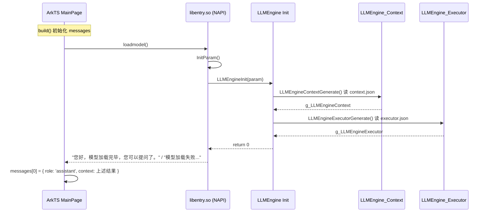
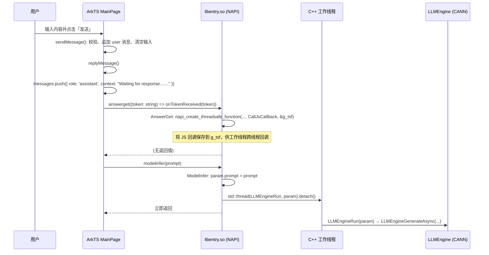
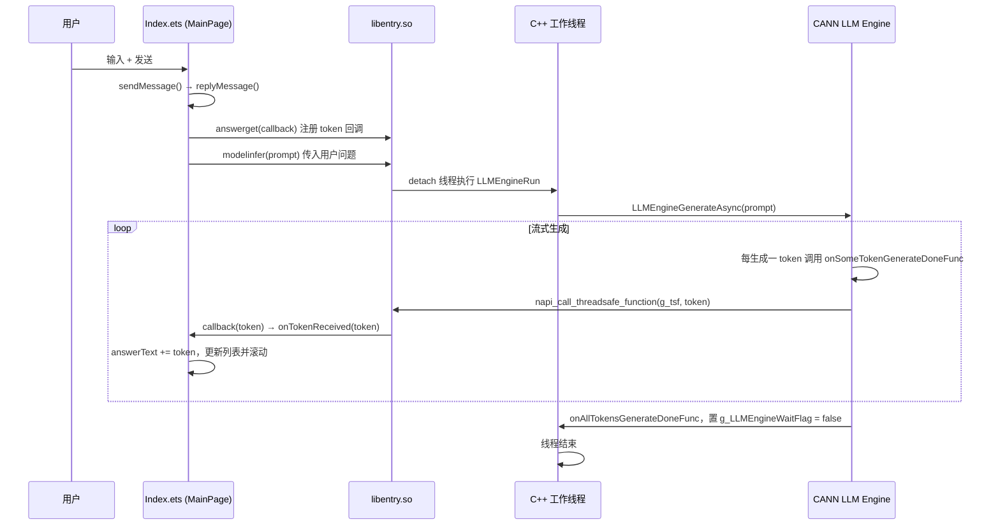

# 本项目大模型推理时序图

基于 `entry/src/main/ets/pages/Index.ets` 与 `entry/src/main/cpp/llm_demo.cpp` 梳理的推理流程。

## 1. 模型加载阶段（应用启动 / 页面初始化）



## 2. 用户发送消息 → 注册回调 → 发起推理



## 3. 异步推理与逐 Token 回传

```mermaid
sequenceDiagram
    participant Worker as C++ 工作线程
    participant Engine as LLMEngine_Executor / Context
    participant NPU as CANN/NPU 推理
    participant g_tsf as napi_threadsafe_function
    participant JS as ArkTS 主线程 (Callback)
    participant UI as MainPage

    Worker->>Engine: LLMEngine_Context_SetOnSomeTokenGenerateDoneFunc(onSomeTokenGenerateDoneFunc)
    Worker->>Engine: LLMEngine_Context_SetOnAllTokensGenerateDoneFunc(onAllTokensGenerateDoneFunc)
    Worker->>Engine: LLMEngine_Context_SetOnGenerateAsyncFailed(onGenerateAsyncFailedFunc)
    Worker->>Engine: LLMEngine_Prompt_Create() / SetText(prompt)
    Worker->>Engine: LLMEngine_Executor_LLM_GenerateAsync(executor, context, prompt)
    Engine->>NPU: Prefill + 逐 Token Decode（CANN 内部）

    loop 每生成一个 Token
        NPU-->>Engine: 新 token 就绪
        Engine->>Engine: onSomeTokenGenerateDoneFunc(ctx)
        Engine->>Engine: GetOneGenerationLen / GetOneGeneration → generation
        Engine->>g_tsf: napi_call_threadsafe_function(g_tsf, token, napi_tsfn_nonblocking)
        g_tsf->>JS: CallJsCallback(env, jsCb, nullptr, token)
        JS->>JS: napi_call_function(jsCb, [token])
        JS->>UI: onTokenReceived(token)
        UI->>UI: answerText += token; 更新 messages 最后一条; scrollEdge(Bottom)
    end

    NPU-->>Engine: 全部生成完成
    Engine->>Engine: onAllTokensGenerateDoneFunc(ctx)：打日志、g_LLMEngineWaitFlag = false
    Worker->>Worker: while(g_LLMEngineWaitFlag) 结束，线程退出
```

## 4. 端到端简图（从用户发起到界面流式更新）



## 关键点小结

| 环节 | 说明 |
|------|------|
| **入口** | 用户点击发送 → `sendMessage()` → `replyMessage()` |
| **回调注册** | `answerget(callback)` 通过 `napi_create_threadsafe_function` 把 ArkTS 的 `onTokenReceived` 存为 `g_tsf`，供 C++ 工作线程安全回调。 |
| **推理触发** | `modelinfer(prompt)` 在新 detach 线程中执行 `LLMEngineRun` → `LLMEngineGenerateAsync`，主线程立即返回。 |
| **流式输出** | CANN 引擎每生成一个 token 调用 `onSomeTokenGenerateDoneFunc`，内部 `napi_call_threadsafe_function(g_tsf, token)` 把 token 推到 JS，最终执行 `onTokenReceived(token)` 更新界面。 |
| **结束** | 全部生成完成后 `onAllTokensGenerateDoneFunc` 被调用，工作线程退出。 |
